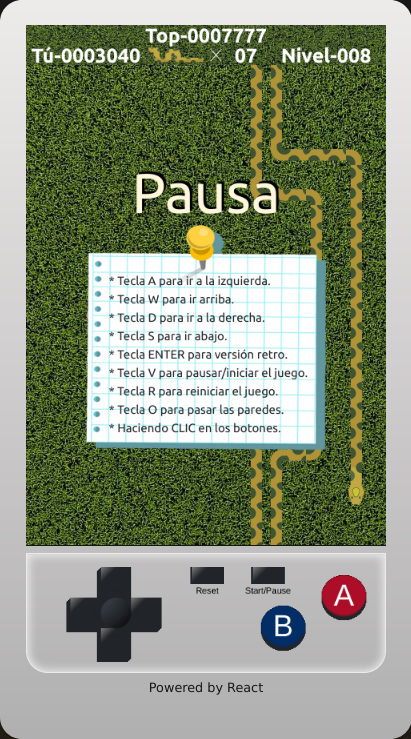
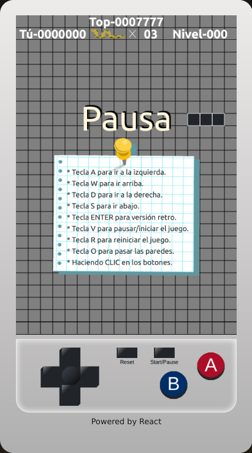

# snake - react


## Descripción
> El juego clásico de la viborita desarrollado con la versión 18.0.2 de React.
> El juego puede ser controlado tanto por el teclado como por el mouse.


## Descargar las dependencias
```
npm install
```

## Iniciar el proyecto
```
Ejecutar `npm run dev` para un iniciar un servidor de desarrollo. Navegar a `http://localhost:5173/`.
```

## Construir el proyecto
```
Ejecutar `nmp run build` para construir el proyecto para produccion. El proyecto construido sera almacenado en la carpeta `dist/`.
```

## Captura de pantalla
<br>
<br>


## Ver juego

<a href="https://alvaro-7x.github.io/snake-react/" target="_blank">Clic aquí</a>


